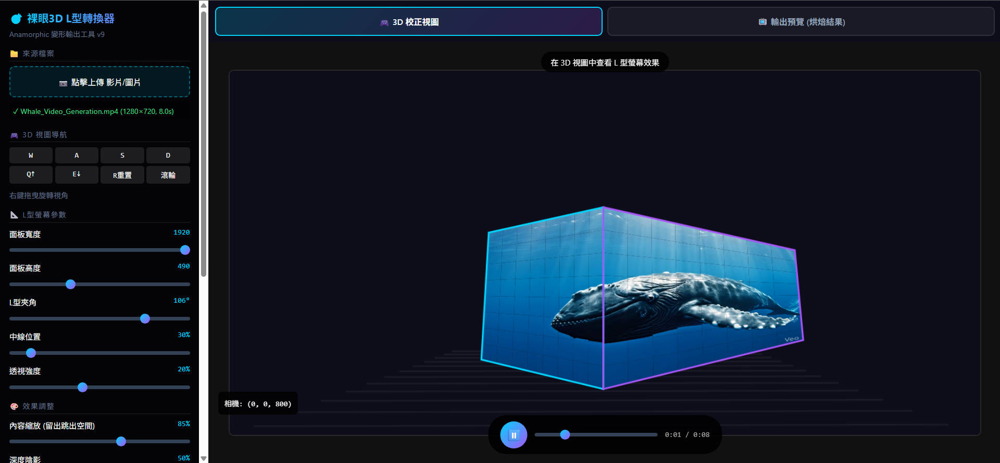

# AnamorphicHtml — L 型螢幕裸眼 3D 實驗 (WIP)

[](https://github.com/ooropuloo/AnamorphicHtml)
[](https://github.com/ooropuloo/AnamorphicHtml/issues)
[](LICENSE)

[English](README_EN.md) | 中文

嘗試使用純前端技術（HTML5 Canvas + JavaScript），探索能否在 **L 型軟性 AMOLED 螢幕** 上實現商場級的「裸眼 3D」效果。



> **⚠️ 目前狀態：效果未達預期**
>
> 目前的演算法能做到幾何上的變形（Deformation），但無法產生讓物體「飛出螢幕」的正確縱深錯覺。
>
> **我非常需要社群的建議與協助！**

---

## 目錄

- [實驗硬體規格](#-實驗硬體規格)
- [核心問題](#-核心問題)
- [目前的解決方案](#️-目前的解決方案)
- [檔案結構](#檔案結構)
- [如何執行](#-如何執行)
- [尋求協助](#-尋求協助)
- [相關技術領域](#-相關技術領域)
- [貢獻方式](#-貢獻方式)

---

## 🖥️ 實驗硬體規格

我不使用拼接螢幕，而是使用一塊完整的 **軟性 AMOLED (Flexible AMOLED)** 彎折成 L 型，這消除了中間的邊框縫隙，理論上應該能提供更完美的錯覺體驗。

| 規格 | 數值 |
|------|------|
| 尺寸 | 6.67 inch |
| 解析度 | 1080(W) × 2400(H)（長寬比約 1:2.2）|
| 顯示區域 | 154.56mm × 69.552mm |
| 彎折方式 | 螢幕中段彎折 90°，形成底面與背面兩個顯示區 |

由於是高解析度的手機級面板，像素密度極高，理論上近距離觀看的細膩度遠勝商場 LED 牆。

---

## ❓ 核心問題

商場裡的 L 型裸眼 3D（例如飛出的太空船、鯨魚）效果驚人。我目前的嘗試是將普通 2D 影片進行梯形校正（Keystone/Mesh distortion）後投射到 L 型螢幕上。

**結果：** ❌ 畫面幾何形狀正確，但看起來就是「貼在轉角上的平面壁紙」，沒有立體感。

### 我目前的推測原因

經過研究，我認為單純的 2D Canvas 變形是不夠的，因為：

1. **缺乏 Off-axis Projection（離軸投影）**：商場的影片是針對特定視點（Sweet Spot），在 3D 軟體中設定非對稱視錐體（Asymmetric View Frustum）渲染出來的，而不是對 2D 影片做後製變形。

2. **缺少深度資訊**：普通的 2D 影片沒有 Z 軸資訊，無法重新映射到 L 型空間中正確的透視位置。

---

## 🛠️ 目前的解決方案

這是一個純前端的實驗工具，無須後端，瀏覽器打開即用。

**技術棧**: HTML5 Canvas 2D (無 WebGL), Vanilla JS

**功能**:
- 雙線性插值網格變形 (Bilinear Interpolation Mesh Deformation)
- 即時預覽 L 型螢幕效果 (3D Preview)
- 參數調整：面板夾角、透視強度、陰影模擬
- **Baking**: 支援將調整好的變形影片匯出為 WebM (VP9)

---

## 檔案結構

```
AnamorphicHtml/
├── images/
│   └── preview.jpg          # 工具預覽截圖
├── anamorphic-3d-converter.html  # 主工具 (3D 預覽 + 參數調整 + 烘焙輸出)
├── index.html               # 舊版 6 點校正工具 (手動標記角點)
├── LICENSE
├── README.md                # 中文說明
└── README_EN.md             # English README
```

---

## 🚀 如何執行

```bash
git clone https://github.com/ooropuloo/AnamorphicHtml.git
cd AnamorphicHtml
# 直接用瀏覽器開啟
open anamorphic-3d-converter.html   # macOS
start anamorphic-3d-converter.html  # Windows
```

或直接下載 HTML 檔案，用任何現代瀏覽器開啟即可。

---

## 🆘 尋求協助

我正在尋找以下領域專家的建議：

### 急需解答的問題

1. **如何在純前端實現 Off-axis Projection？**
   - 是否需要改用 WebGL/Three.js？
   - 有沒有純 Canvas 2D 的近似方案？

2. **如何從 2D 影片「推測」或「模擬」深度資訊？**
   - 機器學習深度估計 (MiDaS, DPT) 在瀏覽器端可行嗎？
   - 有沒有更輕量的方案？

3. **商場級裸眼 3D 內容的製作流程是什麼？**
   - 是否一定要用 3D 軟體（Blender, Unity, Unreal）從頭渲染？
   - 有沒有將現有 2D 素材轉換的方法？

### 如果你有相關經驗，請幫助我！

- 在 [Issues](https://github.com/ooropuloo/AnamorphicHtml/issues) 提出建議
- 提交 [Pull Request](https://github.com/ooropuloo/AnamorphicHtml/pulls) 改進程式碼
- 分享相關論文或資源連結

---

## 🔬 相關技術領域

如果你熟悉以下任一領域，你的見解對我非常有價值：

- **Anamorphic Projection** / 變形投影
- **Off-axis Projection** / 離軸投影
- **Autostereoscopy** / 裸眼立體顯示
- **Forced Perspective** / 強制透視
- **Spatial Computing** / 空間運算
- **WebGL / Three.js** / 網頁 3D 渲染
- **Depth Estimation** / 深度估計
- **Computational Photography** / 計算攝影學

---

## 🤝 貢獻方式

歡迎任何形式的貢獻！

1. **提出問題或建議** → [Open an Issue](https://github.com/ooropuloo/AnamorphicHtml/issues/new)
2. **分享知識** → 在 Issue 中討論技術細節
3. **改進程式碼** → Fork & Pull Request
4. **擴散消息** → Star 這個專案，讓更多人看到

---

## 📄 License

MIT License - 詳見 [LICENSE](LICENSE)
